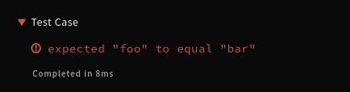
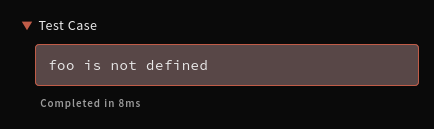
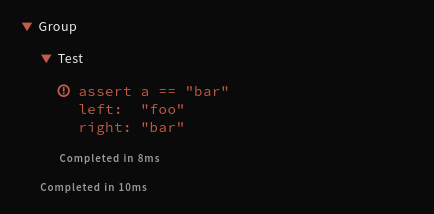

# CodeRunner Messages

CodeRunner uses a simple line-based messages to collect test results and to control the output.

```text
<DESCRIBE::>GROUP_NAME
<IT::>TEST_NAME
<COMPLETEDIN::>DURATION?

<PASSED::>MESSAGE
<FAILED::>MESSAGE
<ERROR::>MESSAGE

<LOG:MODE?:LABEL?>MESSAGE
```

Any newline (`\n`) _within_ a message must be replaced with `<:LF:>`. To prevent users' outputs without trailing newline from interering, messages should prepend `\n`.

> `DESCRIBE` and `IT` comes from BDD test frameworks that was originally used. Think of them as "group" and "test" respectively.


## Rationale

Many test report formats exist, but we needed:

1. Line-based format so that users can see partial results after unexpected test termination (e.g., timeout, crash).
2. Robust format that preserves the outputs from users' code even without test framework capturing and ideally preserve the timing. (e.g., user's logs does not interfere with the test report and it can be displayed under the relevant test case).
3. Simple format to make it as easy as possible to implement in any language.
4. Flexible format to allow authors to produce helpful output. (e.g., useful failure messages, controlling how a message is displayed, images and even interactive output with HTML+JS)

Full XML/JSON reports produced after the test completes is not an option because tests can terminate earlier (1) and XML/JSON may not be easy to work with in some languages (3). TAP (Test Anything Protocol) can easily break when user's code outputs to STDOUT (2), more difficult to implement (3) and not flexible enough (4). TeamCity messages are very similar, but it's more complex (3).

CodeRunner supports over 55 languages at the moment (some with more than one test frameworks) and this has worked well so far for our purpose. For some test frameworks without event hooks, we fall back to post processing. For example, generating messages from full XML/JSON reports or translating newline delimited JSON outputs to our messages.


## Messages

### Test Structure

- Prefix the name of a test group with `<DESCRIBE::>`.
- Prefix the name of a test case with `<IT::>`.
- Output `<COMPLETEDIN::>` with optional duration in milliseconds when test group/case ends.

Think of them as commands to control a stack of test contexts. `<DESCRIBE::>`/`<IT::>` pushes and `<COMPLETEDIN::>` pops.

A test group can contain test groups, but a test case can only contain test results (passed, failed, error) and logs.

### Test Results

- Prefix the message for a passing test/assertion with `<PASSED::>`.
- Prefix the message for a failing test/assertion with `<FAILED::>`.
- Prefix the message for an exception with `<ERROR::>`.

Test case can contain one or more test results, and logs.

### Formatting

Any line without a prefix described above is assumed to be a log output and rendered as is.

> NOTE: On Codewars, it tries to _guess_ if the line should be rendered as HTML for backwards compatibility. However, it should be updated to use the HTML mode explicitly.

- HTML: Prefix the message with `<LOG:HTML:>` to render it as HTML.
- Labeling: Prefix the message with `<LOG::Custom Label>` to set the label used by the log container.
- Collapsing: Prefix the message with a label starting with `-` (`<LOG::-Example>`) to collapse the output by default.


## Examples

<details>
<summary>Passing test</summary>

```text

<IT::>Test Case

<PASSED::>Test Passed

<COMPLETEDIN::>8
```


(passed tests are collapsed)

</details>

<details>
<summary>Failing test</summary>

```text

<IT::>Test Case

<FAILED::>expected "foo" to equal "bar"

<COMPLETEDIN::>8
```



</details>

<details>
<summary>Error message</summary>

```text

<IT::>Test Case

<ERROR::>foo is not defined

<COMPLETEDIN::>8
```



</details>

<details>
<summary>Passing test in a group</summary>

```text

<DESCRIBE::>Group

<IT::>Test

<PASSED::>Test Passed

<COMPLETEDIN::>8

<COMPLETEDIN::>10
```


</details>

<details>
<summary>Failing test in a group</summary>

```text
<DESCRIBE::>Group

<IT::>Test

<FAILED::>assert a == "bar"<:LF:>left:  "foo"<:LF:>right: "bar"

<COMPLETEDIN::>8

<COMPLETEDIN::>10
```



</details>

<details>
<summary>Passing test in a nested group</summary>

```text

<DESCRIBE::>Groups

<DESCRIBE::>Group

<IT::>Test Case

<PASSED::>Test Passed

<COMPLETEDIN::>8

<COMPLETEDIN::>9

<COMPLETEDIN::>10
```


</details>
